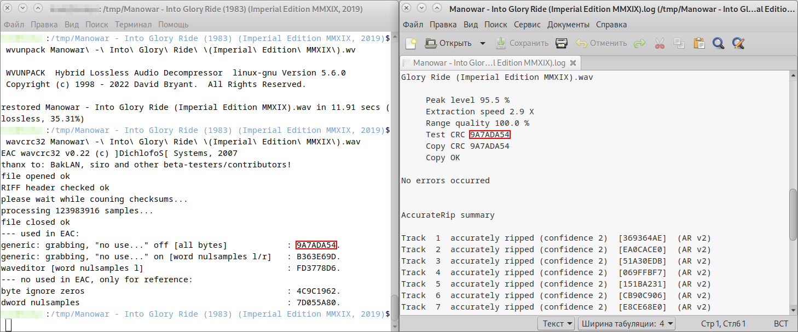
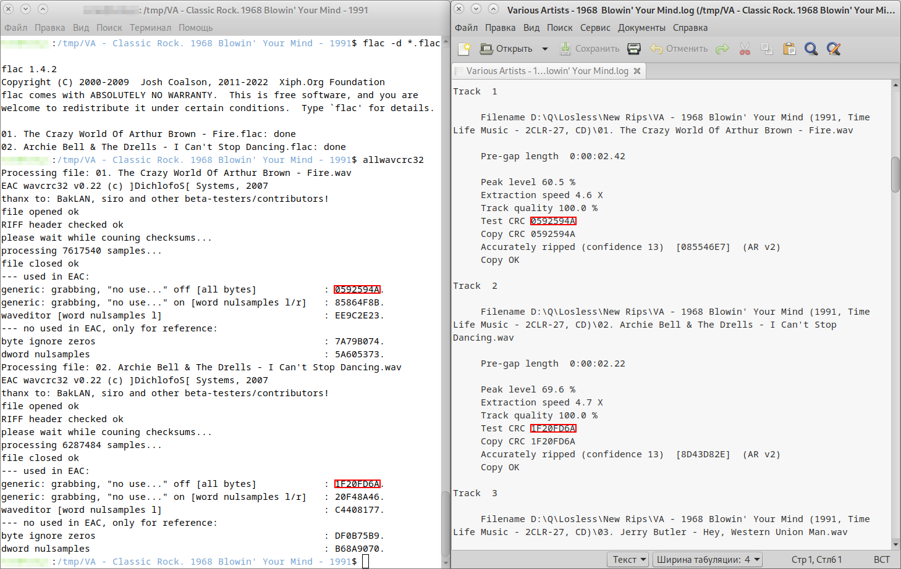

[Russian](#Russian) / [English](./README_EN.md)

## Russian
----------

<p align="center"></p>

**wavcrc32** - Программа для проверки CRC контрольной суммы аудиоданных.

**allwavcrc32** - Скрипт использующий программу wavcrc32 для проверки CRC аудиоданных любого количества wav-файлов в текущей папке.

<p align="right"></p>

В вопросе копирования аудионосителей важно всё. Правильно скопировать, правильно распаковать, правильно проверить, и правильно записать.

Данный репозиторий создан в помощь любителям музыки. В первую очередь, пользователям самых популярных дистрибутивов Linux и MacOS, для которых мной были собраны установочные пакеты, и написан мануал. Windows версия скомпилирована автором исходного кода.

О трудностях проверки контрольной суммы аудиоданных можно почитать [здесь](https://rutracker.org/forum/viewtopic.php?t=357895).

## Оглавление
-------------

* [О wavcrc32 и allwavcrc32](#О-wavcrc32-и-allwavcrc32)
* [Содержимое](#Содержимое)
* [Об установочных пакетах](#Об-установочных-пакетах)
* [Windows](#Windows)
* [Linux](#Linux)
  * [Установка/Удаление wavcrc32 с помощью пакетного менеджера](#УстановкаУдаление-wavcrc32-с-помощью-пакетного-менеджера)
  * [Установка/Удаление wavcrc32 вручную](#УстановкаУдаление-wavcrc32-вручную)
* [MacOS (Intel)](#MacOS-Intel)
  * [Установка установочного пакета wavcrc32 через GUI](#Установка-установочного-пакета-wavcrc32-через-GUI)
  * [Установка установочного пакета wavcrc32 в терминале](#Установка-установочного-пакета-wavcrc32-в-терминале)
  * [Установка/Удаление wavcrc32 вручную](#УстановкаУдаление-wavcrc32-вручную-на-macOS)
* [Использование wavcrc32 и allwavcrc32](#Использование-wavcrc32-и-allwavcrc32)
* [О распаковке FLAC APE WAVPACK](#О-распаковке-FLAC-APE-WAVPACK)
  * [Распаковка FLAC APE WAVPACK на примере Debian Linux](#Распаковка-FLAC-APE-WAVPACK-на-примере-Debian-Linux)
  * [Распаковка FLAC APE WAVPACK на macOS](#Распаковка-FLAC-APE-WAVPACK-на-macOS)
* [Скриншоты](#Скриншоты)
* [Авторы](#Авторы)
* [Дополнительная информация](#Дополнительная-информация)

## О wavcrc32 и allwavcrc32:
----------------------------

**wavcrc32** - программа для проверки CRC контрольной суммы аудиоданных, полученных с помощью EAC (Exact Audio Copy) в Windows, Rubyripper в Linux, XLD (X Lossless Decoder) в macOS и т.д.

**Перед проверкой необходимо распаковать FLAC APE WAVPACK в формат WAV.** По крайней мере одна из контрольных сумм, полученных с помощью wavcrc32, должна совпадать с контрольными суммами из LOG-файла рипа.

Использование **wavcrc32** для проверки CRC аудиоданных **потрекового рипа** очень неудобно, поскольку он может работать только с одним wav-файлом.

Например, если вы введете команду **"wavcrc32 \*.wav"** в вашей музыкальной папке, где находится более одного wav-файла, то программа завершится с ошибкой **"\*\*\* invalid cmdline arguments!"**.

Чтобы рассчитать контрольную сумму всех файлов текущей папки, я написал простой скрипт - **allwavcrc32**.

## Содержимое:
--------------

* `Linux/v0.22/amd64/allwavcrc32.1.gz` - справочная страница (man-page) для скрипта allwavcrc32
* `Linux/v0.22/amd64/allwavcrc32.sh` - скрипт allwavcrc32
* `Linux/v0.22/amd64/allwavcrc32-0.22-2.x86_64.rpm` - 64-х битный rpm-пакет allwavcrc32 + wavcrc32 для дистрибутивов на базе RedHat Linux
* `Linux/v0.22/amd64/allwavcrc32_0.22-1_amd64.deb` - 64-х битный deb-пакет allwavcrc32 + wavcrc32 для дистрибутивов на базе Debian Linux
* `Linux/v0.22/amd64/md5sum.txt` - контрольные суммы
* `Linux/v0.22/amd64/wavcrc32.1.gz` - справочная страница (man-page) для wavcrc32
* `Linux/v0.22/amd64/wavcrc32-0.22-2.x86_64.rpm` - 64-х битный rpm-пакет wavcrc32 для дистрибутивов на базе RedHat Linux
* `Linux/v0.22/amd64/wavcrc32_0.22-1_amd64.deb` - 64-х битный deb-пакет wavcrc32 для дистрибутивов на базе Debian Linux
* `Linux/v0.22/amd64/wavcrc32_v0.22_linux_amd64` - 64-х битный бинарный файл wavcrc32 для Linux
---
* `Linux/v0.22/i386/allwavcrc32.1.gz` - справочная страница (man-page) для скрипта allwavcrc32
* `Linux/v0.22/i386/allwavcrc32.sh` - скрипт allwavcrc32
* `Linux/v0.22/i386/allwavcrc32-0.22-2.i386.rpm` - 32-х битный rpm-пакет allwavcrc32 + wavcrc32 для дистрибутивов на базе RedHat Linux
* `Linux/v0.22/i386/allwavcrc32_0.22-1_i386.deb` - 32-х битный deb-пакет allwavcrc32 + wavcrc32 для дистрибутивов на базе Debian Linux
* `Linux/v0.22/i386/md5sum.txt` - контрольные суммы
* `Linux/v0.22/i386/wavcrc32.1.gz` - справочная страница (man-page) для wavcrc32
* `Linux/v0.22/i386/wavcrc32-0.22-2.i386.rpm` - 32-х битный rpm-пакет wavcrc32 для дистрибутивов на базе RedHat Linux
* `Linux/v0.22/i386/wavcrc32_0.22-1_i386.deb` - 32-х битный deb-пакет wavcrc32 для дистрибутивов на базе Debian Linux
* `Linux/v0.22/i386/wavcrc32_v0.22_linux_i386` - 32-х битный бинарный файл wavcrc32 для Linux
---
* `MacOS/v0.22/allwavcrc32.1` - справочная страница (man-page) для скрипта allwavcrc32
* `MacOS/v0.22/allwavcrc32.sh` - скрипт allwavcrc32
* `MacOS/v0.22/allwavcrc32-0.22.pkg` - 64-х битный установочный пакет allwavcrc32 + wavcrc32 для MacOS
* `MacOS/v0.22/md5sum.txt` - контрольные суммы
* `MacOS/v0.22/wavcrc32.1` - справочная страница (man-page) для wavcrc32
* `MacOS/v0.22/wavcrc32-0.22.pkg` - 64-х битный установочный пакет wavcrc32 для MacOS
* `MacOS/v0.22/wavcrc32_v0.22_macos_x86_64` - 64-х битный бинарный файл wavcrc32 для MacOS
---
* `Windows/v0.11-v0.22/md5sum.txt` - контрольные суммы
* `Windows/v0.11-v0.22/t-357895.rar` - консольная версия 0.22, GUI 0.11 для Windows
---
* `src/md5sum.txt` - контрольные суммы
* `src/wavcrc32v0.22.cpp` - исходный код wavcrc32 v0.22 на языке программирования C++ (C Plus Plus)
---
* `ChangeLog` - история изменений
* `README.md` - данный файл описания

## Об установочных пакетах:
---------------------------

Установочные пакеты **allwavcrc32** для Linux и macOS содержат не только скрипт allwavcrc32, но и саму программу wavcrc32, поэтому **рекомендуется** установить их. 

Установочные пакеты wavcrc32 содержат только саму программу wavcrc32.

## Windows
----------

Оригинальный rar-архив со [страницы](https://rutracker.net/forum/viewtopic.php?t=357895) разработчика. Содержит консольную версию v0.22, и GUI-версию v0.11 для Windows.

**Коментарий автора:**
> В приложении к данному посту имеются архивы с обеими версиями программы для Windows (бинарники + четыре dll-ки, которые нужно кинуть в %WINDIR%\System32, если их там ещё нету + исходник для сборки под *nix).

> Возможные проблемы при запуске консольной версии: если не запускается программа wavcrc32.exe, попробуйте wavcrc32-watcom.exe. Если есть MSVC и опыт работы в нём, можете попробовать пересобрать программу под Windows (исходник кросплатформенный, проблем при компиляции быть не должно).

## Linux
--------

## Установка/Удаление wavcrc32 с помощью пакетного менеджера:
-------------------------------------------------------------

### 1.Клонируйте GitHub репозиторий wavcrc32:
```
$ cd /tmp/
$ git clone https://github.com/Konstantin-Kuney/wavcrc32.git
```

### 2.Перейдите в папку, соответствующую архитектуре вашего дистрибутива Linux:
Для 64-бит:
```
$ cd wavcrc32/Linux/v0.22/amd64/
```
Для 32-бит:
```
$ cd wavcrc32/Linux/v0.22/i386/
```
**Далее на примере 64-бит**.

### 3.Установите пакет wavcrc32 с помощью пакетного менеджера:

Debian/Ubuntu:
```
sudo dpkg -i allwavcrc32_0.22-1_amd64.deb
```

RedHat/Fedora:
```
sudo dnf install allwavcrc32-0.22-2.x86_64.rpm
```

### 4.Удаление wavcrc32 с помощью пакетного менеджера:

Debian/Ubuntu:
```
$ sudo apt-get purge allwavcrc32
```

RedHat/Fedora:
```
$ sudo dnf remove allwavcrc32
```

## Установка/Удаление wavcrc32 вручную:
---------------------------------------

### 1.Клонируйте GitHub репозиторий wavcrc32, и перейдите в папку, соответствующую архитектуре вашего дистрибутива Linux. (см.выше).

### 2.Сделайте бинарный файл wavcrc32 и скрипт allwavcrc32 исполняемыми:
```
$ chmod +x wavcrc32_v0.22_linux_amd64
$ chmod +x allwavcrc32.sh
```

### 3.Скопируйте их в папку для хранения основных исполняемых файлов:
```
$ sudo cp -f wavcrc32_v0.22_linux_amd64 /usr/bin/wavcrc32
$ sudo cp -f allwavcrc32.sh /usr/bin/allwavcrc32
```

### 4.Скопируйте мануалы в папку для хранения справочных страниц (man-pages):
```
$ sudo cp -f wavcrc32.1.gz /usr/share/man/man1/
$ sudo cp -f allwavcrc32.1.gz /usr/share/man/man1/
```

### 5.Удаление wavcrc32 вручную:
```
$ sudo rm /usr/bin/wavcrc32
$ sudo rm /usr/share/man/man1/wavcrc32.1.gz
$ sudo rm /usr/bin/allwavcrc32
$ sudo rm /usr/share/man/man1/allwavcrc32.1.gz
```

## MacOS (Intel)
----------------

## Установка установочного пакета wavcrc32 через GUI:
-----------------------------------------------------

**1.Дважды щелкните по скачанному файлу allwavcrc32-0.22.pkg**

**2.Откроется окно установщика. Нажмите "Продолжить" (Continue) и следуйте инструкциям на экране.**

**3.Введите пароль администратора, когда система запросит его для подтверждения установки.**

## Установка установочного пакета wavcrc32 в терминале:
-------------------------------------------------------
```
$ sudo installer -pkg /путь/к/пакету/allwavcrc32-0.22.pkg -target /
```

## Установка/Удаление wavcrc32 вручную на macOS:
------------------------------------------------

### 1.Сделайте бинарный файл wavcrc32 и скрипт allwavcrc32 исполняемыми:
```
$ chmod +x wavcrc32_v0.22_macos_x86_64
$ chmod +x allwavcrc32.sh
```

### 2.Скопируйте их в папку для хранения основных исполняемых файлов:
```
$ sudo cp -f wavcrc32_v0.22_macos_x86_64 /usr/bin/wavcrc32
$ sudo cp -f allwavcrc32.sh /usr/bin/allwavcrc32
```

### 3.Скопируйте мануалы в папку для хранения справочных страниц (man-pages):
```
$ sudo cp -f wavcrc32.1 /usr/share/man/man1/
$ sudo cp -f allwavcrc32.1 /usr/share/man/man1/
```

### Удаление wavcrc32 вручную:
```
$ sudo rm /usr/bin/wavcrc32
$ sudo rm /usr/share/man/man1/wavcrc32.1
$ sudo rm /usr/bin/allwavcrc32
$ sudo rm /usr/share/man/man1/allwavcrc32.1
```

## Использование wavcrc32 и allwavcrc32:
----------------------------------------

Например, вы хотите проверить все wav-файлы в вашей музыкальной папке. Перейдите в нее, и запустите скрипт:
```
$ cd /tmp/music
$ allwavcrc32
```

Результат проверки можно вывести в файл:
```
$ allwavcrc32 > wavcrc32.txt
```

Например, вы хотите проверить только один файл **filename.wav**, просто введите:
```
$ wavcrc32 filename.wav
```

Подробнее в мануалах:
```
$ man allwavcrc32
$ man wavcrc32
```

## О распаковке FLAC APE WAVPACK:
------------------------------------

>FLAC, APE (Monkey's Audio) и WavPack (.wv) - это форматы сжатия звука без потерь (lossless), которые уменьшают размер аудиофайлов без потери качества звука. Они обеспечивают 100% точное восстановление оригинала, идеальны для архивирования.

**Важно!** Не конвертировать, а **распаковывать** их.

## Распаковка FLAC APE WAVPACK на примере Debian Linux:
-------------------------------------------------------

Установка кодеков для распаковки:
```
$ sudo apt-get install flac wavpack monkeys-audio
```

Для установки пакета `monkeys-audio`, в /etc/apt/sources.list добавьте мультимедиа репозиторий `www.deb-multimedia.org`!

Распаковка:

APE
```
$ mac filename.ape filename.wav -d
```

FLAC
```
$ flac -d filename.flac
```

WavPack
```
$ wvunpack filename.wv
$ wvunpack filename.iso.wv
```

## Распаковка FLAC APE WAVPACK на macOS:
----------------------------------------

Установка кодеков для распаковки:
```
$ brew install flac wavpack mac
```

Для установки кодеков должен быть установлен [Homebrew](https://brew.sh/ru/)!

Распаковка аналогична Linux. См.выше.

## Скриншоты:
-------------

<div align="center">


</div>

## Авторы:
----------

**dmvn \]DichlofoS\[ Systems** - **Автор**. Создание исходных кодов на C++, компиляция консольной версии и версии с GUI (с Графическим Интерфейсом Пользователя) для Windows. Публикация и обсуждение на форуме.

**BakLAN, siro. и DrStandBy** - замечания, предложения и тестирование Windows версий.

**Konstantin Kuney** - Компиляция программы и сборка пакетов для Linux и MacOS, создание мануалов, создание скрипта allwavcrc32, создание этого GitHub репозитория и описания.

## Дополнительная информация:
-----------------------------

[Официальная страница разработчика проекта](https://rutracker.net/forum/viewtopic.php?t=357895)

[Страница форума для обсуждения проекта](https://rutracker.net/forum/viewtopic.php?t=1955422)

[Данный GitHub репозитроий](https://github.com/Konstantin-Kuney/wavcrc32)

---

[Go up / Вверх](#Russian)

